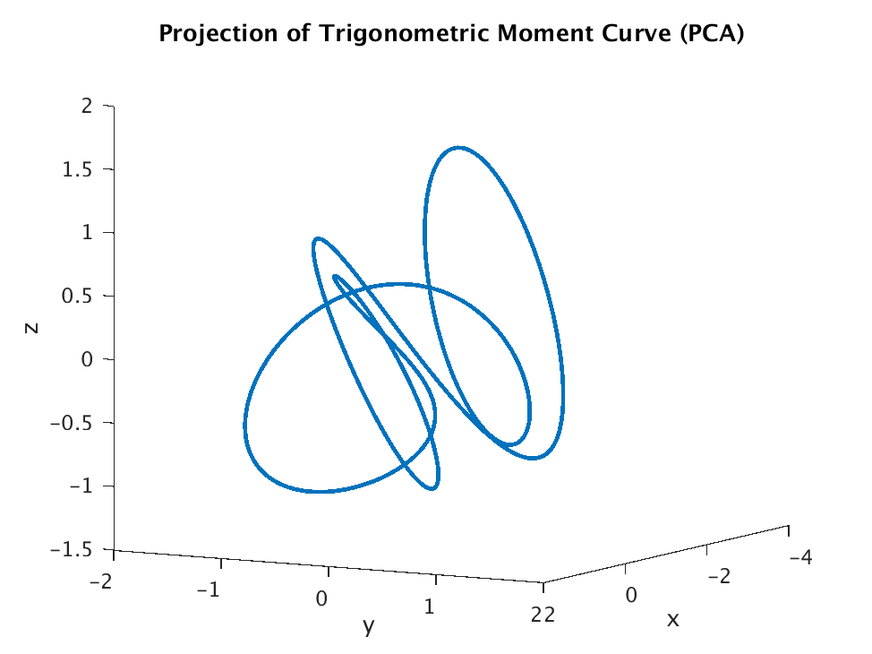
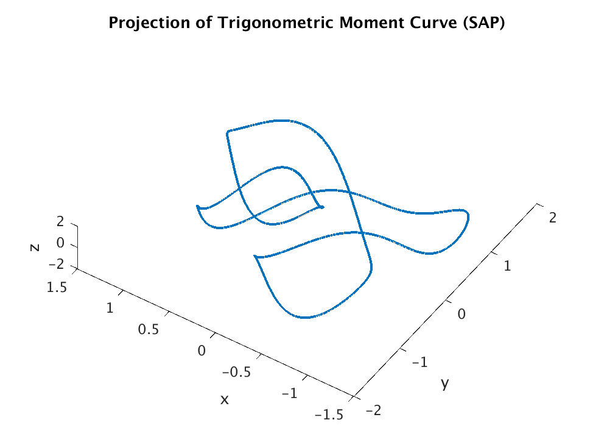

# The secant-avoidance projection algorithm

The secant avoidance projection (SAP) algorithm is a secant-based dimensionality reduction algorithm. 
Very roughly it searches for projections that preserve the spatial relations among points in a data set.
This is equivalent to preserving the secant set of the data set. The SAP algorithm was introduced in the paper
[*A GPU-Oriented Algorithm Design for Secant-Based Dimensionality Reduction*](https://ieeexplore.ieee.org/document/8452022). 
Two slide presentations that cover aspects of SAP and other secant-based dimensionality reduction algorithms can be found
[here](https://hkvinge.github.io/HKvinge_BigData_2018_short.pdf) and [here](https://hkvinge.github.io/HKvingeHPEC2018.pdf).

The code found in this repository is written in C++/CUDA to run SAP on Nvidia GPU's. 
When developing SAP, one of our goals was to create a dimensionality reduction algorithm 
that is relatively light weight. 
Bringing in GPU computing was one way in which we tried to meet this goal.

There are many reasons to favor a secant based approach to dimensionality reduction. 
Many useful properties of projections can be naturally related to preserving secants in a specific way.
For example, finding projections that satisfy the optimization problem in the **Mathematical details** section below
is equivalent to finding projections that are bi-Lipschitz on the data and hence both preserve the topological dimension of the data and also have a well-condition inverse on the data. 
In particular, the SAP algorithm yields very different kinds of projections compared. 
This is illustrated in a small example. 
For a much more compelling example related to determining the intrinsic dimension of a data set, see [slide 14](https://hkvinge.github.io/HKvinge_BigData_2018_short.pdf).

 

*Figure: Two projections of the trigonometric moment curve from 10-dimensional space into 3-dimensional space. 
The picture on the left corresponds to the projection obtained from PCA, the right from SAP.
It is visually clear that these two projections have a significantly different flavor.*

# What is in this repository?

This repository contains the following files for a C++/CUDA implementation of SAP:

* *SAP.cu*: The SAP function as well as a little CUDA error checking code. The SAP function transfers data (both the actual data points and an initial projection and some algorithm parameters) to the GPU where the algorithm is run by making library calls to CUBLAS and CUSOLVER and also calling certain custom kernels from *kernels.cu*.

* *kernels.cu*: Contains the custom kernels called by the SAP function. Most of these are fairly elementary. I expect that some of these could actually be replaced by calls to the CUBLAS library. This may be updated in the future. 

* *kernels.cuh*, *SAP.cuh*: CUDA header files.

* *example_call.cu*: Contains an example call of the SAP function.

* *initial_projection*: Currently, example_call.cu loads an initial projection from the text file initial_projection.txt. This initial projection is stored in a text file with one float per line. 
Despite being essentially 1-dimensional, this array can be thought of as a matrix stored in column-major format. 
The columns of this matrix form an orthonormal set of vectors with the same dimension as the input data. 
They span the subspace into which the data will be projected. 
The first entry of the text file is the dimension of the projection, i.e. the subspace dimension into which the projection projects, the rank of the projection matrix, or the number of orthonormal columns. 
For this file, the projection dimension is 4.
It is assumed that the user has already specificed the number of rows (or column height) by the dimension of the data set in *example_data_points.txt*.

* *example_data_points.txt*: This text file contains some sample data points that *example_call.cu* loads and runs SAP on. The text file contains one float per line. 
This (effectively 1-dimensional array) can be treated as a matrix in column-major format. 
That is, the 1-dimensional array can be read in as many stacked columns. 
Data points correspond to these columns. 
The dimension of the data points (in this case 10) is the first entry of the text file. 
The second entry is the number of points (in this case 256). 
Thus the data in this file can be thought of as a (10 x 256) matrix (after the first two entries have been removed). 

I have also provided a Python implementation of SAP. 

* *secant_functions.py*: This contains two functions. One which calculates the secants of a data set *get_secants()* and one which runs the actual SAP algorithm, *SAP()*.

* *SAP_example.py*: This code gives an example of how to run this implementation of SAP in Python.

# Mathematical details

The SAP algorithm tries to iteratively reach a solution to the optimization problem:

Very roughly, at each iteration the SAP algorithm shifts the projection subspace so as to better capture the current secant most diminished under projection.
The two main parameters then are the number of iterations and the step-size. 
We have found that for many data sets, reasonable convergence can be obtained with 30-200 iterations and with a step size between .05-.01. 
It is perhaps not surprising that smoother convergence is obtained by choosing a smaller step-size though in this case convergence is slower. 
In the future we plan to include an option to attentuate the step-size with each iteration. 
In our implementation, the *L2*-norm of the most diminished secant is recorded at each iteration of the algorithm and displayed after the algorithm is done running. 
This is useful to determining whether the algorithm is converging or has converged.

The optimization problem shown above is non-convex and therefore one should expect that in general SAP will find a local maximum rather than the global maximum. 
We have experimented using both a random orthogonal initial projection and the projection obtained via principal component analysis. 
Empirically, it seems that random projections can often find better solutions than initializations using PCA. 

For a much more detailed description of the SAP algorithm see our paper [*A GPU-Oriented Algorithm Design for Secant-Based Dimensionality Reduction*](https://ieeexplore.ieee.org/document/8452022).

# Large secant sets and noise

Because the number of secants grows as *O(n^2)*, where *n* is the number of data points, for data sets with many points (say over 5,000) it is often more practical to subsample secants. We hope implement this option later.

As described in our paper, when the data set contains a significant amount of noise it is often useful to omit secants that are sufficiently small before normalizing them as these secants can be completely controlled by noise and do not reflect structure in the data.
An option for doing this is not currently implemented but might be in the future.

# Running the code

We have included a makefile for use on Unix machines. The user only needs to fill in details related to the location of Nvidia libraries, etc.

